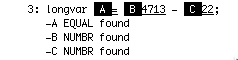

# CS 442 - Compiler Construction
## IOMngr Repository

This repository contains files to be added to your main project repository to include the IOMngr module. The IOMngr is responsible for

* returning source characters to the caller one at a time
* associating messages (e.g. compiler errors or warnings) with source lines
* writing processed source lines to stdout along with associated messages

The repository contains

- IOMngrDriver.c
    - This is the test driver for the assignment. This driver opens the source and listing files and repeatedly requests the next character from the source file. When specific patterns of characters are seen it posts appropriate messages.  

- IOMngr.h
    - The include file defining the functions implemented by the IOMngr. 

- IOMngr.c
	- A stub for the implementation file. 
	
- IOMngrSource
    - A source file for testing.

- IOMngrSource-#.out
    - The output from testing. 

- Makefile
    - An extended Makefile containing the rules required for building and testing the project. 

## The Assignment

Complete the IOMngr.c file by implementing the functions defined in SymTab.h. Once the source file is opened, GetSourceChar() will return the next available character or EOF if the end of file has been encountered. GetSourceChar() is also responsible for echoing source lines to stdout. Depending on the mode of operation either all lines or only lines with associated messages are echoed to stdout. 

When written to stdout the source line

```
longvar = 4713 - 22;
```

will appear as



The source line is preceeded by a line number (use a max of 5 digits). Messages are associated to columns in the source with marker tags. Highlighting of marker tags and underlining of source text is accomplished using ANSI Terminal Escape Codes. The necessary escape codes, which can be included in the printf format string, are 

* ``\033[7m`` - turn on reverse highlighting
* ``\033[4m`` - turn on underlining
* ``\033[0m`` - reset all attributes

Because of the required behavior for marking message locations in the source line and displaying messages immediately below source lines it is necessary for the implementation to read source lines in their entirety, buffer them internally, and return single characters from the buffer as requested. Prior to reading a new buffer line the current line must be written to stdout along with any associated messages. Depending on the lineEchoMode set when OpenSource() is called either all lines are written to stdout or only lines with associated messages. 

The IOMngrDriver implements a table based state machine to recognize a few simple token types. Some of these token types generate messages. The driver tests that GetSourceChar() will continue to return EOF after the end of file is encountered by requiring that EOF be returned 3 times before exiting. If PostMessage() is done for the EOF token the message lines will all appear to use marker "A" since there really is no line corresponding to the EOF.

The driver supports two command line options. 

* ``-m`` - sets lineEchoMode to true
* ``-u`` - close and exit on unknown token

The first controls whether all lines are echoed to output or only lines with messages. The second is used to test output is handled correctly when processing is aborted before the end of the input file. 

The project can be tested with ``make iotest`` which will invoke 3 different tests (e.g. all lines listed, only message lines listed, exit on unknown token).

## What to Do

- DO NOT FORK this repository on Gitlab, instead
- On your development machine, in a location different than your assignment repository, clone this project. Your original Project repository will continue to accumulate all files for the project. 
- Copy the files from this repository to your Project repository. The new Makefile will replace the existing copy.
- Discard the clone of this repository.
- Complete the IOMngr.c file by implementing the required functionality.
- When complete, 
    - "make clean" to remove object files and executables
    - use git to add and commit your changes to your local repository
    - use git to push the project back up to your GitLab account
    - I should already be a member of your project repository
    - create an issue on your project repository, listing me as assignee, with a title of "Submit for grading"
